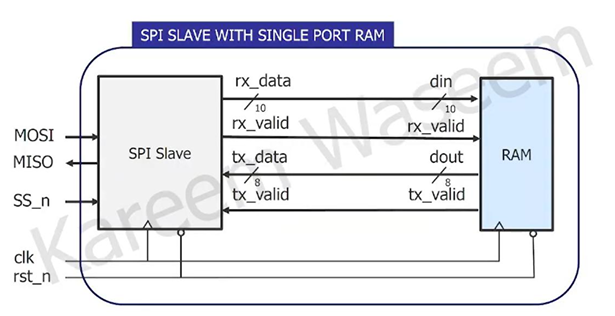
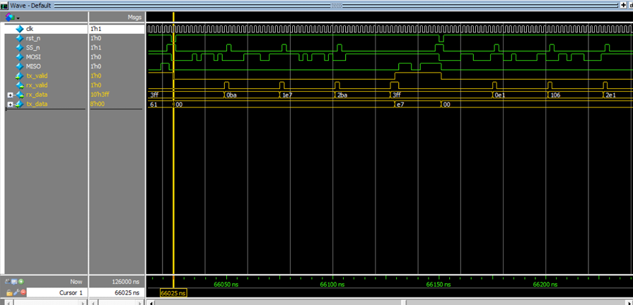
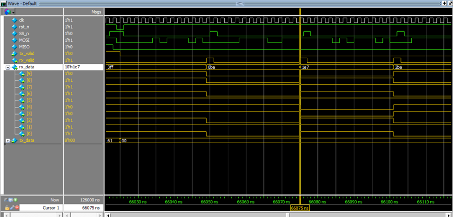
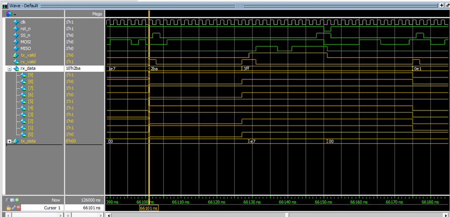
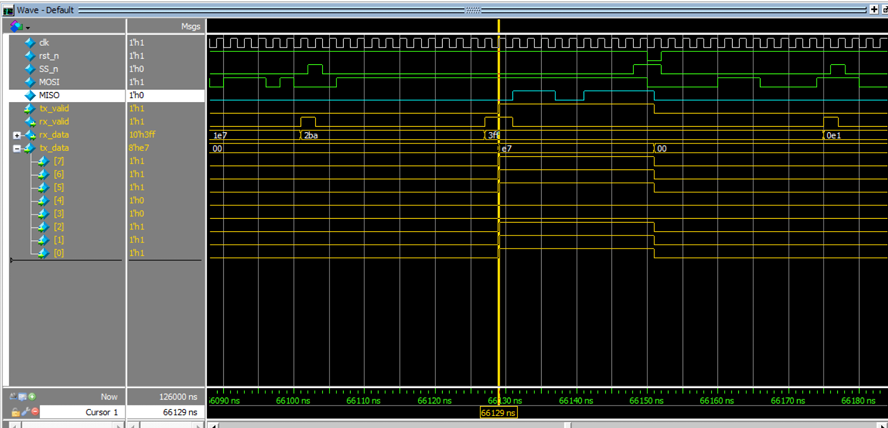

# SPI Slave with Single-Port RAM – Digital Design Project

## Overview
This project implements a **SPI Slave module** connected to a **Single-Port Synchronous RAM** using Verilog/SystemVerilog.  
It supports reading and writing through SPI communication, with internal RAM storage for received data.  
The project includes **simulation waveforms**, **schematics**, and **bitstreams** for FPGA implementation.

The design has been tested and verified through functional simulation, synthesis, and implementation.

<!-- SPI Wrapper -->
<div>
    <h3>SPI Wrapper Block Diagram</h3>
    
    <p>The SPI Wrapper integrates the SPI Slave and Single-Port RAM, connecting <code>rx_data</code> and <code>tx_data</code> 
    signals between the modules, enabling read/write operations via SPI.</p>
</div>

---

## Features
- **SPI Slave FSM** with 5 states:
  - `IDLE`
  - `CHK_CMD`
  - `WRITE`
  - `READ_ADD`
  - `READ_DATA`
- **FSM encoding experiments**:
  - Sequential (`(* fsm_encoding = "sequential" *)`)
  - One-hot encoding
  - Gray encoding
  - Compared on **timing performance** and **FPGA area utilization**. Best chosen based on synthesis reports.
- **Most significant 2-bit tagging** in `rx_data`:
  - `2'b00` → Address
  - `2'b01` → Write Data
  - `2'b10` → Read Address
  - `2'b11` → Read Data
- **Single-Port Synchronous RAM** with:
  - 8-bit data width
  - 256 memory locations
  - Read and write controlled by `rx_valid`
- Simulation testbenches provided
- **Timing verified** and bitstream generated for FPGA

---

## Project Structure

```
├── Pictures/ → Simulation waveforms & block diagrams
├── Bit_File/ → Generated .bit FPGA configuration file
├── Netlist_File/ → Synthesized netlist files
├── Constrain_File/ → XDC constraint files for FPGA pin mapping
├── Do_File/ → Simulation script files
├── Testbench_Code/ → Verilog testbench source files
├── RTL_Verilog/ → RTL design source code (SystemVerilog)
├── Document.pdf/ → Full project report (design + verification + results)
```

---

## Technology Stack
- **Verilog/SystemVerilog** – RTL design
- **QuestaSim** – Simulation
- **QuestaLint** – Lint Check
- **Xilinx Vivado** – Synthesis, Implementation, FPGA Programming
- **Basys3 FPGA** – Testing platform
- FSM encoding strategies: **Sequential, One-hot, Gray**
- **Timing & area analysis** using Vivado synthesis reports

---


<h2>Simulation Results</h2>

<!-- msb_00 -->
<div>
    <h3>MSB = 00</h3>
    
    <p>After the first write state address is being written in <code>rx_data</code> as well as most significant 2 bits 
    which are <code>2’b00</code> to declare that the data is address (<code>ba</code>).</p>
</div>

<!-- msb_01 -->
<div>
    <h3>MSB = 01</h3>
    
    <p>After the second write state data is being written in <code>rx_data</code> as well as most significant 2 bits 
    which are <code>2’b01</code> to declare that the data is <code>wr_data</code> (<code>e7</code>).</p>
</div>

<!-- msb_10 -->
<div>
    <h3>MSB = 10</h3>
    
    <p>After the second write state data is being written in <code>rx_data</code> as well as most significant 2 bits 
    which are <code>2’b01</code> to declare that the data is <code>wr_data</code> (<code>e7</code>).</p>
</div>

<!-- msb_11 -->
<div>
    <h3>MSB = 11</h3>
    
    <p>After the second read state data is being written in <code>rx_data</code> as well as most significant 2 bits 
    which are <code>2’b11</code> but the rest 8 data are dummy. After that, <code>tx_valid</code> is raised so 
    <code>tx_data</code> could read the data being written in (<code>ba</code>) address 
    (same as the data we just wrote in (<code>e7</code>)). Also, <code>MISO</code> is being transmitted bit by bit (<code>1110 0111</code>).</p>
</div>

---

## Documentation

A detailed project report (`Document.pdf`) is included in the repository with:
- RTL design breakdown
- Testbench development
- Verification results
- DO files and constraint settings
- All Vivado reports

---

## Author

**Mazen Mohamed Hemdan**  
Bachelor of Computer Engineering  
Focus: Digital Design, Computer Architecture, Hardware Verification
